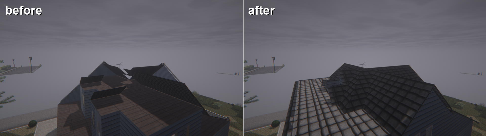
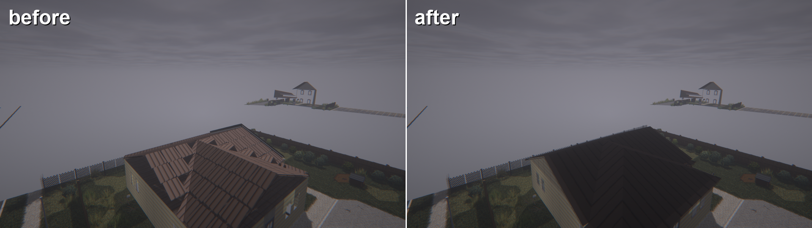
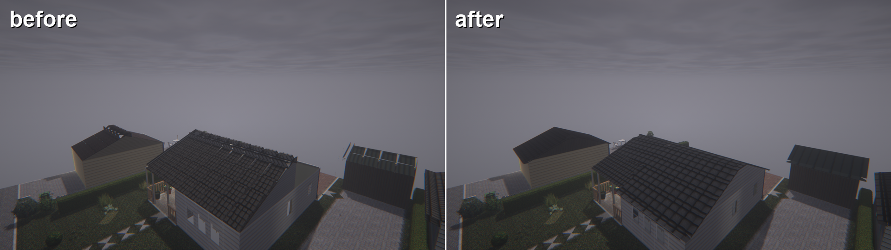
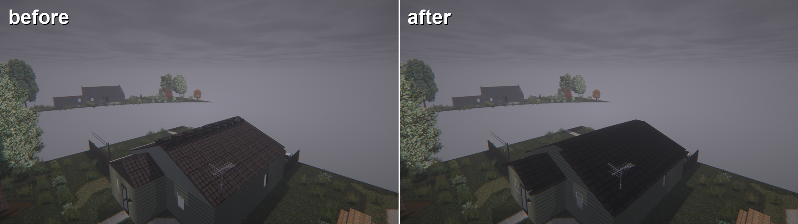
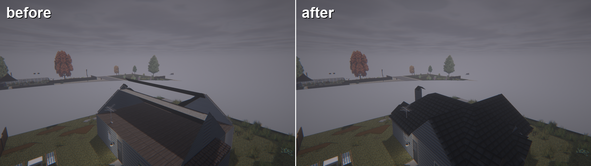

# Viewpoint - Building Fix

A companion patch for **Project Viewpoint** (true first person for Project Zomboid Build 42) that makes buildings look whole up close.

Project Zomboid's maps are drawn for an isometric camera, so they only contain what that camera can see. In first person this shows up everywhere: roofs with one slope missing, open attics, holes at hips and valleys, plates and strips floating in the air, see-through windows and roofs without ceilings. This mod rebuilds those parts for the whole map automatically, with no per-building edits.

## Screenshots

## What it does

- **Roofs built from the room plan.** Every building gets a watertight roof generated from its rooms. Gable, hip, cross-gable, L/T-shaped, lean-to and half-storey roofs are recognised from the map's own tiles, which are read straight from the map files, so a building always looks the same however much of it is loaded.
- **The map's art, kept.** Pitch, height and texture come from the building's own roof tiles. Gambrel/mansard roofs and flat roofs with skylights keep their original pieces.
- **Eaves and trims.** Roofs reach past the walls with soffits, fascia and barge boards, and sit right on the wall tops.
- **Gable walls.** The triangles between the walls and the roof are closed with the building's own exterior siding. Steps between wings of different height are closed too.
- **Clean-up.** Loose eave plates, gutters, ridge strips, map gable triangles and walls that would poke through the new roof are removed.
- **Exact roof shapes.** Corner, ridge-cap and half pieces get true 3D shapes measured from the game's depth maps, and flat roof tiles are flat.
- **Ceilings** under every room except over stairs.
- **Windows** are visible from both sides.
- **Walls.** The room side of a wall shows the room's wallpaper, and the outside of north/west walls uses the building's main facade.
- **Furniture** no longer shows through walls from outside.

## Requirements

- Project Zomboid 42.21 or newer
- [Project Viewpoint](https://steamcommunity.com/sharedfiles/filedetails/?id=3809306528)
- [ZombieBuddy](https://steamcommunity.com/sharedfiles/filedetails/?id=3619862853)

## Installation

1. Copy the `ViewpointRoof` folder into `%UserProfile%\Zomboid\mods`.
2. Enable **Viewpoint - Building Fix** together with Viewpoint and ZombieBuddy.
3. On the first launch, allow the mod in the ZombieBuddy prompt (it loads Java code).

## Usage

Everything works automatically. Press **Shift+F10** in game to switch the fixes on and off and compare.

## Notes

- Client only. Nothing is saved to your world, and the mod can be removed at any time.
- From a very low angle next to a wall, Viewpoint itself can draw the top of a far roof slope dark. This happens without the mod too.
